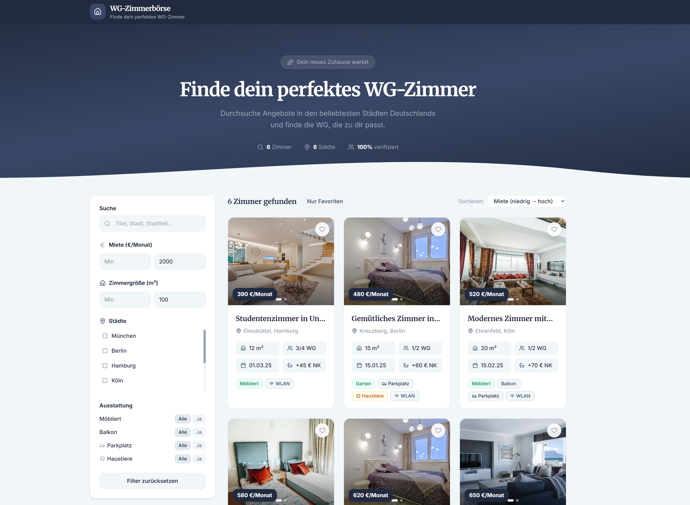

# wg-zimmer-frontend

## Local Dev

```bash
npm install
npm run dev
```

## Docker

```bash
docker build -t wg-zimmer-frontend .
docker run -p 8080:80 wg-zimmer-frontend
```

Open [http://localhost:8080](http://localhost:8080).
